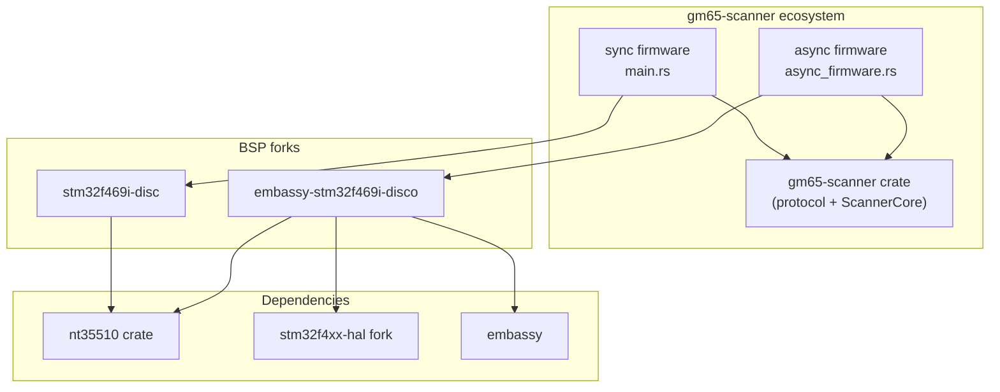
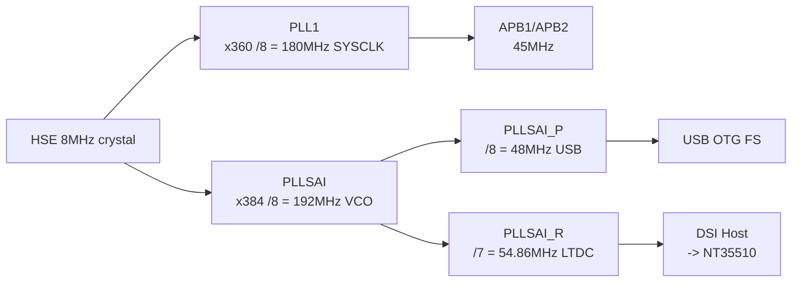
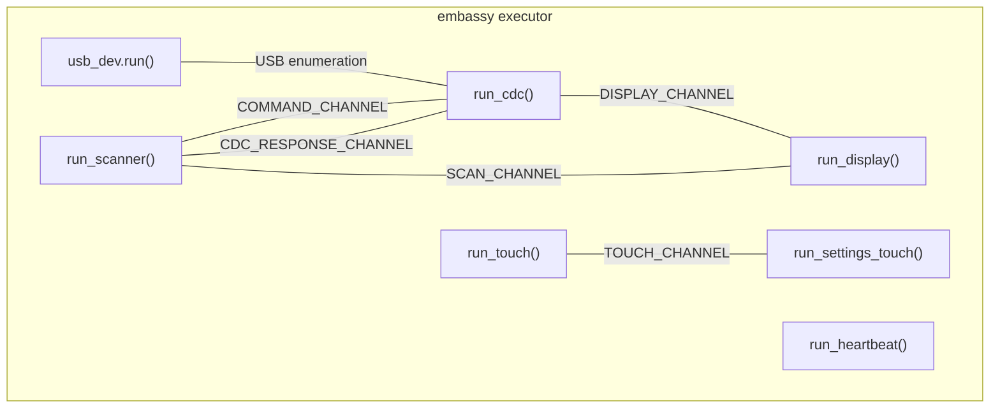
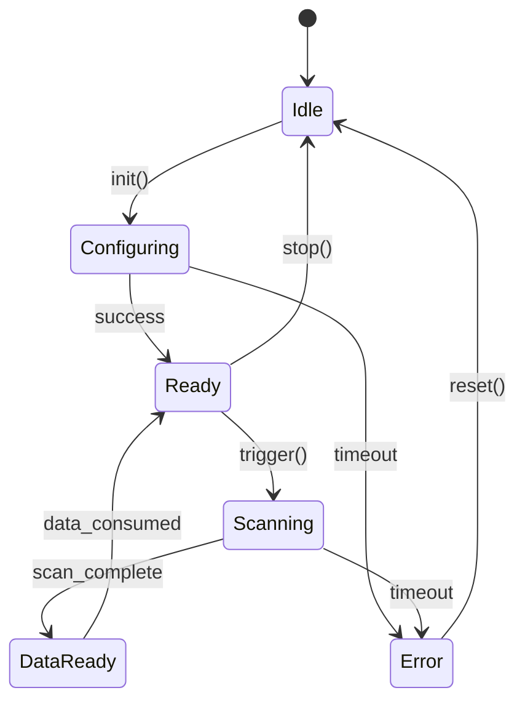

# Agent Reference

## Architecture Overview



## Hardware

- Board: STM32F469I-Discovery (STM32F469NIHx)
- Scanner: GM65/M3Y, firmware 0x87
- UART: USART6, PG14 (TX) / PG9 (RX), 115200 baud
- USB: USB OTG FS, PA12 (DP) / PA11 (DM)
- Display: 480x800 portrait via DSI/LTDC (NT35510), RGB888/ARGB8888 pixel format
- SDRAM: 16MB via FMC, framebuffer 1.5MB (u32 x 384000 pixels)
- Touch: FT6X06 on I2C1 (PB8=SCL, PB9=SDA), identity transform
- Clock: 180MHz SYSCLK (production). See 180MHz USB Clock Fix section for full PLL config.

### Clock Tree



## Known-Good Pins

| Commit | Notes |
|--------|-------|
| `ceb8b0e` (stm32f469i-disc main) | Known-good production state. All display fixes: PORTRAIT_DSI timing (V_SYNC=120/V_BP=150/V_FP=150), LP sizes 16/0, 120ms delay, DSI/LTDC sync. RGB565 + ARGB8888 both verified. Touch verified. USB CDC verified. Deps switched to git refs for CI (nt35510 rev 263d8e4, stm32f4xx-hal rev 0c5bc3d). Commits `5e153cb`, `9992edd`, `64f75c6`, `ceb8b0e`. |
| `9992edd` (stm32f469i-disc) | ARGB8888 display fix: DSI/LTDC timing synced with PORTRAIT_DSI (V_SYNC=120/V_BP=150/V_FP=150). LP sizes 16/0 + 120ms delay. User confirmed: horizontal shift fixed, all edges visible. Commits `5e153cb`, `7481809`, `9992edd`. |
| `8b8b828` (main HEAD) | Current production. All unsafe blocks have SAFETY comments (#43). Test helpers gated #[cfg(test)] (#42). Scanner init fixed (#45). USB transmutes removed (#46). Both firmware targets hardware-verified. 324 library tests pass. |
| `67fcbf3` | Post-audit verification. cdc.rs send_response now returns false on write timeout/partial. Async try_send discards clarified with `let _`. 3 real bugs filed (#53 CDC blocking during auto_scan, #54 AsyncUart silent error retry, #55 driver robustness). Both firmwares HW-verified. |
| `HEAD` | Three fixes: #53 with_timeout(200ms) on auto_scan read_scan select. #54 UART error counting. #29 EXTI interrupt-driven touch on PJ5 (FT6X06 G_MODE=0x01). Screen, touch, QR scan all HW-verified working. |
| `3ddb01d` | Decomposed 700-line main into 8 functions, fixed 20+ silent channel drops, removed dead code. |
| `9ce9158` | 180MHz async firmware: LTDC ISR flag clearing fix, task gating for scanner init, PLLSAI_P=DIV8 for USB. All CDC commands verified at 180MHz. |

## Touch Calibration

- **Touch controller**: FT6X06 on I2C1 (PB8=SCL, PB9=SDA)
- **Vendor ID**: 0x11 (verified)
- **Coordinate transform**: Identity -- `dx=tx, dy=ty` (raw FT6X06 coords map directly to display pixels)
- **Framebuffer**: Portrait 480x800 (display orientation is Portrait, NOT Landscape)
- **Key finding**: FT6X06 X register (0x03-0x04) ranges 0-480, Y register (0x05-0x06) ranges 0-800
- **Touch test binary**: `touch_test` -- 6 target rectangles, raw coordinate display, hit detection. HW verified.
- **BSP issue**: embassy-stm32f469i-disco#21 documents the missing orientation-dependent transform

## BSP Diagnostic Examples

BSP-level diagnostic binaries have been moved out of this repo to their respective BSP forks.

### Embassy BSP (`/home/ubuntu/src/embassy-stm32f469i-disco/examples/`)

| Binary | Purpose |
|--------|---------|
| `display_minimal.rs` | Standalone DSI/LTDC, 4 color bands, portrait 480x800 |
| `display_hybrid.rs` | BSP `DisplayCtrl::new()` in embassy context |
| `async_display_test.rs` | Async display rendering test |
| `embassy_display_bsp_minimal.rs` | Minimal embassy display BSP test |
| `nt35510_hwtest.rs` | NT35510 panel hardware test (register reads) |
| `async_cdc_minimal.rs` | Minimal embassy USB CDC test |
| `display_test_rgb565.rs` | RGB565 pixel format display test |

### Sync BSP (`/home/ubuntu/src/stm32f469i-disc/examples/`)

| Binary | Purpose |
|--------|---------|
| `usb_minimal.rs` | Minimal blocking USB CDC test |
| `display_test_rgb888.rs` | RGB888 pixel format display test |

Build and flash from each BSP repo directory, not from this repo.

## Production Build Commands

```bash
# Sync firmware (blocking USB stack, screen, scanner)
cargo build --release --target thumbv7em-none-eabihf \
  --manifest-path examples/stm32f469i-disco/Cargo.toml \
  --bin stm32f469i-disco-scanner \
  --no-default-features --features sync-mode

# Async firmware (embassy USB stack, screen, scanner, touch)
cargo build --release --target thumbv7em-none-eabihf \
  --manifest-path examples/stm32f469i-disco/Cargo.toml \
  --bin async_firmware \
  --no-default-features --features scanner-async

# Flash (use st-flash, NOT probe-rs, for USB testing)
arm-none-eabi-objcopy -O binary \
  target/thumbv7em-none-eabihf/release/<binary> /tmp/<binary>.bin
st-flash --connect-under-reset write /tmp/<binary>.bin 0x08000000
st-flash --connect-under-reset reset

# Touch calibration test (display + touch, no scanner/USB)
cargo build --release --target thumbv7em-none-eabihf \
  --manifest-path examples/stm32f469i-disco/Cargo.toml \
  --bin touch_test \
  --no-default-features --features sync-mode
```

### Debug builds (with RTT, USB will NOT work)

**IMPORTANT: CDC commands use 3-byte framed format `[cmd, len_high, len_low]`.** Raw single-byte opcodes will not get a response. For example, ScannerStatus is `\x10\x00\x00`, not `\x10`.

```bash
# Sync HIL tests (uses probe-rs RTT)
cargo build --release --target thumbv7em-none-eabihf \
  --manifest-path examples/stm32f469i-disco/Cargo.toml \
  --bin hil_test_sync \
  --no-default-features --features hil-tests,defmt

# Async HIL tests (uses probe-rs RTT)
cargo build --release --target thumbv7em-none-eabihf \
  --manifest-path examples/stm32f469i-disco/Cargo.toml \
  --bin hil_test_async \
  --no-default-features --features scanner-async,defmt,gm65-scanner/hil-tests

# Async with RTT debug logging (USB will NOT enumerate)
cargo build --release --target thumbv7em-none-eabihf \
  --manifest-path examples/stm32f469i-disco/Cargo.toml \
  --bin async_firmware \
  --no-default-features --features scanner-async,defmt
```

## HIL Test Results

### 2026-04-11 -- CDC protocol verification + async firmware fix

- **Key finding**: CDC `FrameDecoder` expects 3-byte framed commands `[cmd, len_high, len_low]`, not raw single-byte opcodes. Sending raw `0x10` for ScannerStatus produces no response -- must send `\x10\x00\x00`.
- **Key finding**: `select(usb_dev.run(), scanner.init())` pattern is fundamentally broken -- embassy docs state dropping `UsbDevice::run()` "may leave the bus in an invalid state." Removed in commit `9dc8305`.
- **Key finding**: `join(scanner_task, cdc_task)` instead of `select()` worsens executor starvation (6 poll points vs 4), breaking scanner init at 168MHz. Reverted. See issue #41.
- **180MHz PLL fix hardware-verified**: See 180MHz USB Clock Fix section. Full firmware at 180MHz: USB enumerates + CDC responds (non-scanner commands), but scanner init fails due to executor starvation (issue #40).

**Async firmware CDC test (168MHz, commit `9dc8305`):**

| Command | Bytes Sent | Response | Status |
|---------|-----------|----------|--------|
| ScannerStatus | `\x10\x00\x00` | `00 00 03 01 01 01` | connected=1 |
| GetSettings | `\x13\x00\x00` | `00 00 01 81` | 0x81 |
| Trigger | `\x11\x00\x00` | `00 00 00` | Ok |
| ScannerData | `\x12\x00\x00` | `12 00 00` | NoData |

**Build verification (all targets, 149/149 lib tests pass):**
- `async_firmware` (scanner-async)
- `stm32f469i-disco-scanner` (sync-mode)
- `touch_test` (sync-mode)
- `usb_minimal` (scanner-async)

### Historical HIL results

| Date | Tests | Pass | Notes |
|------|-------|------|-------|
| 2026-04-23 | Async prod + Sync prod | 8/8 | Post-audit verification. Sync all 4 CDC (24-141ms). Async CDC at 180MHz, scanner connected (GetSettings 152ms, Trigger 2052ms #53, ScannerData 22ms). cdc.rs send_response return-value fix, async try_send clarity. Audit found 3 real bugs filed as #53/#54/#55; sync auto_scan/vendor_id audit claims verified FALSE POSITIVES. Issue #49 closed. |
| 2026-04-23 | Async prod | 4/4 | CDC smoke at 180MHz, scanner connected. ScannerStatus 91ms, GetSettings 152ms, Trigger 2052ms (auto_scan blocking #19), ScannerData 22ms. Three fixes verified: UART settle delay, touch gating removal, settings touch handler. |
| 2026-04-14 | Async prod | 4/4 | CDC smoke test. Touch gating removed, NoScanData documented, clippy clean all 4 targets. |
| 2026-04-12 | Sync prod | 4/4 | CDC smoke test. #[inline(always)] fix for #44. USB enum OK, all CDC commands respond. |
| 2026-04-12 | Sync prod | 4/4 | Scanner init regression fix (#45). ScannerStatus connected=1, Trigger=Ok. StaticCell USB, SAFETY comments (#46). |
| 2026-04-05 | Sync 6, Async 9 | 15/15 | InitAction state machine, BSP `799df39`. Sync QR 25 bytes, Async QR 23 bytes. BarType VERIFY FAIL expected (#10). |
| 2026-04-05 | Sync prod, Async prod | Both | USB CDC production verification. Sync `16c0:27dd`, Async `c0de:cafe`. Five root causes fixed (see Async CDC section). |
| 2026-03-31 | Sync 6, Async 9 | 15/15 | InitAction state machine, BSP `56a0bc8` (HAL 0.5, embedded-hal 1.0). Same test pattern as 04-05. |
| 2026-03-31 | Sync prod, Async prod | Both | USB CDC verification with `st-flash`. Both enumerate, display + scanner + USB active. |
| 2026-03-28 | Sync 6, Async 9 | 15/15 | Native binaries, both drivers, real QR scans. Sync 50-retry loop. |

## Known Issues

- **BarType register not persisted (#10)**: Register 0x002C write accepted but not persisted across GM65 reboots on firmware 0.87. Hardware quirk.
- **Settings mode comparison (#11)**: 0x81 vs 0xD1 not yet compared. Current firmware uses 0x81.
- **drain_uart data loss (#12)**: FIXED. `send_command()` skips drain when in `Scanning` state.
- **Async CDC no data flow (#19)**: RESOLVED. Five root causes fixed (see Async CDC section below).
- **BSP memory.x wrong flash size**: embassy-stm32f469i-disco `memory.x` declares 1024K flash but STM32F469NIHx has 2048K. Filed as [Amperstrand/embassy-stm32f469i-disco#19](https://github.com/Amperstrand/embassy-stm32f469i-disco/issues/19).
- **Heap/framebuffer overlap**: `DisplayOrientation::fb_size()` returns pixels (384,000), not bytes. Framebuffer uses `u32` (4 bytes/pixel, ARGB8888), so actual size is `fb_size() * 4` (1,536,000 bytes). Heap offset must account for this or allocator metadata gets corrupted by display writes. Previously was `u16` (Rgb565) at 2 bytes/pixel.

## Resolved Issues

### USB CDC + defmt_rtt Incompatibility

RESOLVED: `defmt_rtt` (even unused via `use defmt_rtt as _`) prevents USB OTG FS enumeration. Two interacting causes: (1) `defmt_rtt` uses `critical_section::acquire()` which disables all interrupts including USB OTG, breaking enumeration timing (RM0090 32.4.4). (2) probe-rs hardcodes blocking mode for RTT; if the buffer fills during enumeration, `flush()` busy-waits with interrupts disabled. See [stm32f469i-disc#23](https://github.com/Amperstrand/stm32f469i-disc/issues/23) and [embassy-rs/embassy#2823](https://github.com/embassy-rs/embassy/pull/2823).

**Do NOT use defmt_rtt or panic_probe in firmware that enables USB CDC.**

Fix applied: `default-features = false` on workspace deps, conditional panic handlers (`panic_halt` for production, `panic_probe` with `defmt` feature), conditional `defmt.x` generation in `build.rs`, BSP fork dep changed from `features = ["defmt"]` to conditional `embassy-stm32f469i-disco/defmt`. See git history for full details.

### Embassy Async: USB + Scanner Init Ordering

RESOLVED: Scanner init must run inside the embassy task (via `join4`), not before `usb_dev.run()`. The cooperative executor can't poll USB during blocking scanner UART init. Also required: disable USART6 interrupt before creating the UART and register a USART6 handler in `bind_interrupts!`.

### Async CDC: Root Causes

RESOLVED: Async firmware enumerated as `c0de:cafe` but no data flowed. Five independent root causes:

1. ~~PLLSAI `divq: None` crashes MCU~~ -- Misdiagnosis. Display works with `divq: None`. Real crash was double USART6.disable + yield starvation. See 180MHz USB Clock Fix section.
2. Double `USART6.disable()` crashes MCU -- second call triggers undefined behavior. Fixed by removing duplicate.
3. `AsyncUart::read()` busy-poll (500K spins) starved USB in cooperative executor. Fixed by yielding immediately on every `WouldBlock`.
4. CDC task channel race -- `try_receive()` on response channel polled before scanner task processed command. Fixed by using `receive().await`.
5. `[ALIVE]` heartbeat every 3s corrupted protocol framing. Fixed by removing heartbeat entirely.
6. Mutex guards held across `.await` caused deadlocks. Fixed by splitting lock scopes.

### Sync Firmware USB CDC Regression (#44)

RESOLVED: Returning the large `Hardware` struct (~500+ bytes) from `init_hardware()` via ARM ABI sret corrupts USB OTG FS peripheral registers. The AAPCS passes return values larger than 16 bytes through the stack pointer, and the resulting stack frame layout corrupts USB peripheral state. Fixed with `#[inline(always)]` on `init_hardware()` which eliminates the function call boundary — compiled output is identical to having all init code in `main()`.

**Evidence**: Inlining the same code into `main()` works. Static allocation (`static mut MaybeUninit<Hardware>`) also fails. The issue is NOT related to 48MHz USB clock, PLLSAI config, or register offsets.

**Sync firmware CDC smoke test (commit `16eb22f`):**

| Command | Bytes Sent | Response | Status |
|---------|-----------|----------|--------|
| ScannerStatus | `\x10\x00\x00` | `00 00 03 00 00 01` | connected=0 |
| GetSettings | `\x13\x00\x00` | `00 00 01 81` | 0x81 |
| Trigger | `\x11\x00\x00` | `10 00 00` | ScannerNotConnected |
| ScannerData | `\x12\x00\x00` | `12 00 00` | NoScanData |

### Async Display Black Screen

RESOLVED: BSP fork DSI timing values were wrong (VSA=1/VBP=15/VFP=16 vs correct VSA=120/VBP=150/VFP=150), NULL_PACKET missing, PLLSAI divq incorrectly "fixed", and pixel format mismatch. See [embassy-stm32f469i-disco#20](https://github.com/Amperstrand/embassy-stm32f469i-disco/issues/20).

Key learnings preserved from investigation:
- DSI vertical timing values are RAW line counts, not scaled to DSI lane byte clocks. Only horizontal timing needs scaling via `LANE_BYTE_CLK_KHZ / LCD_CLOCK_KHZ`.
- Raw `reg32_write()` vs `stm32_metapac` typed accessors: raw writes overwrite reserved bits and cause black screens. Use `.modify()`/`.write()` (read-modify-write). Embassy's `init_layer()` had a CFBLL off-by-one bug for STM32F4: used `+7` instead of `+3` (RM0090 17.7.6).
- The nt35510 crate may have incorrect init sequences for embassy's DSI implementation. Hardcoded commands from the working example should be preferred.
- 180MHz SYSCLK is required for display (PLLSAI pixel clock derivation). 168MHz doesn't work. See 180MHz USB Clock Fix section.
- Panel autodetection works: reading 0xDA/0xDB/0xDC via `DsiReadCommand` returns valid panel ID bytes after init.

Files: `display_minimal.rs` and `display_hybrid.rs` at `/home/ubuntu/src/embassy-stm32f469i-disco/examples/`. Reference: [embassy dsi_bsp.rs](https://github.com/embassy-rs/embassy/blob/83e0d3780e42e3edf1f85d8ce75057baeb6927b4/examples/stm32f469/src/bin/dsi_bsp.rs) (commit `83e0d37`). ST BSP: [stm32469i_discovery_lcd.c](https://github.com/STMicroelectronics/32f469idiscovery-bsp/blob/main/stm32469i_discovery_lcd.c).

```bash
# display_minimal (standalone DSI/LTDC, defmt, no USB)
# Build from /home/ubuntu/src/embassy-stm32f469i-disco/
cargo build --release --target thumbv7em-none-eabihf \
  --bin display_minimal --no-default-features --features defmt
arm-none-eabi-objcopy -O binary target/thumbv7em-none-eabihf/release/display_minimal /tmp/display_minimal.bin
st-flash --connect-under-reset write /tmp/display_minimal.bin 0x08000000
st-flash --connect-under-reset reset

# display_hybrid (BSP DisplayCtrl::new(), defmt, no USB)
cargo build --release --target thumbv7em-none-eabihf \
  --bin display_hybrid --no-default-features --features defmt
```

### Async CDC: Remaining Issues

- **Scanner task blocks on auto_scan**: During `read_scan()` (up to 10s timeout), `COMMAND_CHANNEL.try_receive()` is not polled. CDC commands sent during auto_scan are queued but not processed until the scan cycle completes. Fix: use `embassy_futures::select` to handle commands while scanning.
- **GetSettings/Trigger fail during auto_scan**: Same root cause as above -- scanner task can't process CDC commands while awaiting scan result.

### ARGB8888 Display Alignment (issues #50, #52, #47)

RESOLVED: Three independent bugs caused the ~128px horizontal shift and top-row crop in ARGB8888 mode. All fixed across three repos.

**Root causes:**
1. **LP packet sizes + missing 120ms delay** (`5e153cb` in stm32f469i-disc): ARGB8888 init used LP sizes 64/64; embassy uses 16/0. Missing 120ms delay after `dsi_host.start()` before panel init. This was the ~128px horizontal shift.
2. **DSI/LTDC vertical timing mismatch** (`9992edd` in stm32f469i-disc): When `PORTRAIT_DSI` timing was added for DSI, the LTDC still received `STANDARD_PORTRAIT`. DSI ran at 1220 lines/frame, LTDC at 832 lines/frame. The LTDC background color (`0xAAAAAAAA`) bled through as visible blue/gray content.
3. **Wrong vertical blanking values** (`022fd40` in nt35510): `STANDARD_PORTRAIT` uses V_SYNC=1/V_BP=15/V_FP=16 (OTM8009A values, not NT35510). Correct values: V_SYNC=120/V_BP=150/V_FP=150 per ST NT35510 component header. Caused top-row crop.

**What was NOT the problem:** PLLSAI pixel clock was already 27,429 kHz (override reverted in `a36ab36`). COLMUX caching was not a factor.

**PLLSAI P/Q preservation** (`0c5bc3d` in stm32f4xx-hal): Separate bug — `ltdc.rs` used `.write()` on `pllsaicfgr()` which zeroed P/Q dividers (breaks USB 48MHz). Changed to `.modify()`.

**Critical rule:** DSI and LTDC must receive identical timing configuration. Any mismatch causes visible artifacts.

## 180MHz USB Clock Fix (commit 9ce9158)

The authoritative PLL configuration for 180MHz SYSCLK with USB CDC. Hardware-verified in production.

**Required PLL config:**
```rust
// PLL1: SYSCLK = 8MHz / DIV8 * MUL360 / DIV2 = 180MHz
config.rcc.pll = Some(Pll { prediv: PllPreDiv::DIV8, mul: PllMul::MUL360, divp: Some(PllPDiv::DIV2), divq: Some(PllQDiv::DIV7), divr: Some(PllRDiv::DIV6) });
// PLLSAI: P=48MHz USB, R=54.86MHz LTDC pixel clock
config.rcc.pllsai = Some(Pll { prediv: PllPreDiv::DIV8, mul: PllMul::MUL384, divp: Some(PllPDiv::DIV8), divq: Some(PllQDiv::DIV8), divr: Some(PllRDiv::DIV7) });
config.rcc.mux.clk48sel = mux::Clk48sel::PLLSAI1_Q;
// DCKCFGR2 workaround (embassy writes to wrong register)
stm32_metapac::RCC.dckcfgr2().modify(|w| { w.set_clk48sel(mux::Clk48sel::PLLSAI1_Q); });
```

**Why PLLSAI_P, not Q**: The `PLLSAI1_Q` enum is misleading on STM32F469 -- hardware actually routes PLLSAI_P to the 48MHz clock mux. `divp: DIV8` gives 384MHz/DIV8 = 48MHz. See embassy-stm32f469i-disco#14.

**PLLSAI note**: USB 48MHz comes from PLLSAI_P (not PLL1_Q -- PLL1_Q can't produce 48MHz at 180MHz SYSCLK). Display pixel clock comes from PLLSAI_R. `divq: None` on PLL1 is fine -- PLL1 provides SYSCLK and APB clocks only. Display works with `divq: None` on PLLSAI.

**Reference binary**: `usb_minimal.rs` has this exact config and is hardware-verified.

Scanner init starvation was resolved by fixing LTDC ISR flag clearing and gating non-essential tasks behind SCANNER_INIT_DONE signal (issue #40).

## Task Architecture



### Scanner State Machine



### Async Scanner Not Detected

RESOLVED: The async firmware had no UART settle delay after creating the USART6 peripheral. The sync firmware has `cortex_m::asm::delay(sysclk_hz / 2)` (500ms at 180MHz) between UART init and scanner.init(). The async firmware's display init (320ms) happened before the UART was created, providing zero settle time. The GM65 module needs settle time after UART pin configuration to avoid interpreting GPIO transitions as start bits. Fixed by adding `embassy_time::Timer::after(500ms)` after `Uart::new_blocking()` in `init_peripherals()`.

### Async Touch Not Working

RESOLVED: Commit `9ce9158` added `SCANNER_INIT_DONE.wait().await` to `run_touch()` and `run_settings_touch()` to prevent executor starvation during scanner init. This caused touch to never start when scanner init hung or failed. Touch is an independent peripheral (I2C1, FT6X06) with no dependency on scanner state. Fixed by removing the gating from both touch tasks. Display and heartbeat tasks retain the gate since they depend on scanner state for rendering.

### CDC NoScanData Status (#49)

RESOLVED: `Status::NoScanData (0x12)` is a valid, expected CDC response — not an error. It's a separate status code from `Error (0xFF)`. When no barcode has been scanned, the firmware returns `[0x12, 0x00, 0x00]`. This is a transient condition: the host should retry or wait. Added documentation to the `Status` enum classifying codes as success/expected/error.

### nt35510 Register Values (#22)

RESOLVED: Line-by-line comparison of `init_with_config()` against ST's official `nt35510.c` (stm32469i_discovery BSP) confirms all register values match exactly, including B5, B6, B7, BA. TEEON command is present. RGB888 init exists as `init_rgb888()`. The earlier discrepancy notes were historical or confused with the ARGB8888 pixel shift fix (which was LP packet sizes + DSI/LTDC timing, not register values). Added ST BSP provenance comments to init code.

## Future Work

- **RGB565 + RGB888 dual pixel format support** ([#21](https://github.com/Amperstrand/gm65-scanner/issues/21)): BSP currently hardcodes RGB888/ARGB8888. Future refactoring to support both formats (via generics, config enum, or separate examples). embedded-graphics natively favors RGB565. DMA throughput difference (2x) unlikely to matter at 60Hz with 480x800 panel.
- **nt35510 crate improvements** ([#22](https://github.com/Amperstrand/gm65-scanner/issues/22)): Register values verified correct — all match ST's official `nt35510.c` (B5/B6/B7/BA confirmed). TEEON present. RGB888 init exists. Remaining: builder/raw API for custom init sequences (v0.3.0+).

## Upstream Interaction Policy

**NEVER file PRs or issues on upstream projects without human review.** See [Amperstrand/micronuts#19](https://github.com/Amperstrand/micronuts/issues/19) for retrospective.

## ST-LINK Recovery

Kill stale processes before any probe-rs operation:
```
pkill -9 probe-rs; sleep 3
```

If `interface is busy` persists or xHCI controller dies (all USB devices vanish):
```
echo 1 | sudo tee /sys/bus/pci/devices/0000:02:00.0/remove
sleep 2
echo 1 | sudo tee /sys/bus/pci/rescan
sleep 3
probe-rs list
```

Find PCI address on other machines: `sudo lspci -nn | grep -i "xHCI"`

Use `st-flash --connect-under-reset` for CDC testing. `probe-rs` holds SWD and prevents the firmware from running -- use probe-rs only for RTT-based HIL tests.
