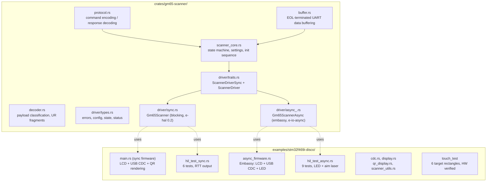
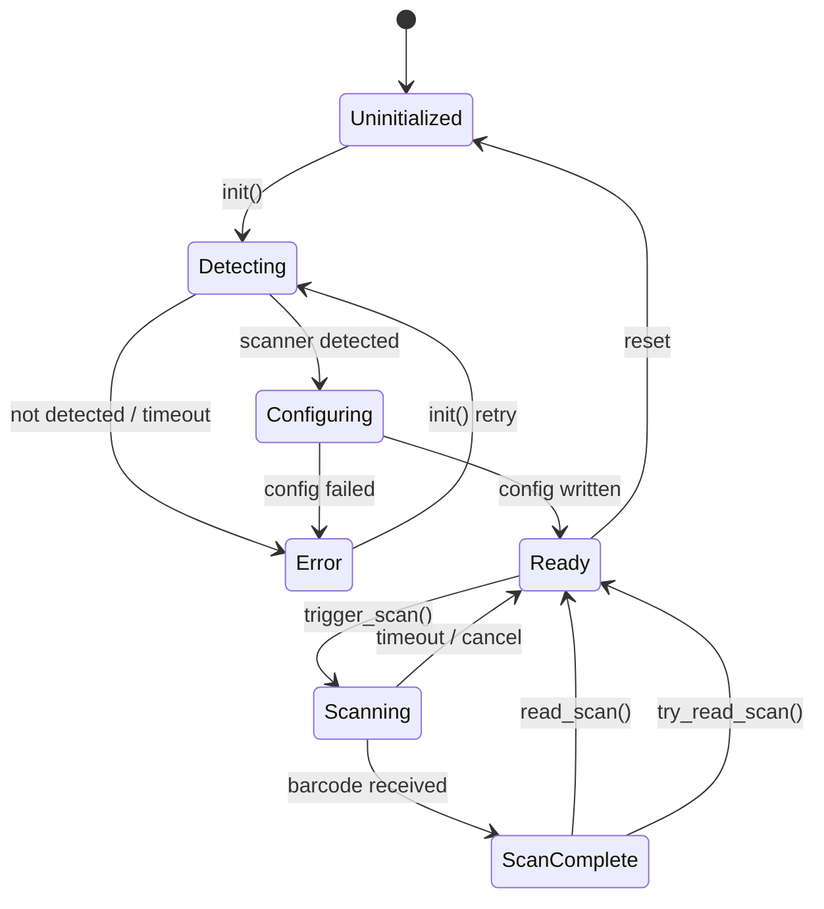
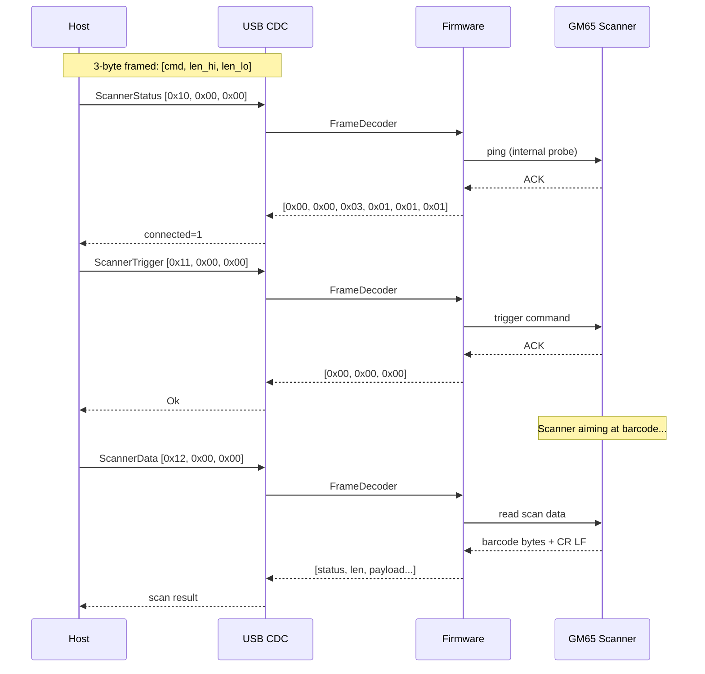

[](https://crates.io/crates/gm65-scanner)
[](https://docs.rs/gm65-scanner)
[](LICENSE)

# gm65-scanner

`no_std` Rust driver for GM65/M3Y QR barcode scanner modules with firmware examples.

## Overview

- **Library** (`crates/gm65-scanner/`) — Sans-IO core with sync and async drivers, 149 unit tests (175 with async feature)
- **Firmware** (`examples/stm32f469i-disco/`) — Scanner application for STM32F469I-Discovery board

## Features

| Feature | Description |
|---------|-------------|
| Sync driver | `Gm65Scanner<UART>` with `embedded-hal-02` traits |
| Async driver | `Gm65ScannerAsync<UART>` with `embedded-io-async` traits |
| HIL tests | Hardware-in-the-loop tests for both drivers |
| QR display | Generate and display QR codes on LCD |
| USB CDC | Host control via virtual serial port |

## Architecture



## Sync vs Async Drivers

Both drivers share the same `ScannerCore` state machine and protocol logic. The only difference is the I/O execution model.

| | Sync (`Gm65Scanner`) | Async (`Gm65ScannerAsync`) |
|--|----------------------|---------------------------|
| **HAL traits** | `embedded-hal 0.2` blocking Read/Write | `embedded-io-async` async Read/Write |
| **Execution** | Polling main loop, `fn` methods | Embassy executor, `async fn` with RPITIT |
| **Timeout** | Spin-loop (fixed iteration count) | `embassy_time::with_timeout` (wall-clock) |
| **Memory** | No heap allocator needed for I/O | Requires `#[global_allocator]` (heap) |
| **Concurrency** | Single task only | Multiple concurrent tasks (scanner + USB + display) |
| **Interrupts** | UART interrupts unused (pure polling) | USART6 interrupt must be explicitly disabled (uses blocking UART + async wrapper) |
| **Best for** | Simple firmware, minimal dependencies | Complex firmware with USB/display/LED, real-time deadlines |
| **Use in micronuts** | No | Yes (primary consumer) |

### When to use sync

- Simple polling main loops (trigger scan, check result, repeat)
- Firmware without USB or display
- Minimal dependency footprint (no embassy, no heap)
- HIL testing with quick iteration (no executor setup)

### When to use async

- Firmware with concurrent peripherals (USB CDC + scanner + LCD + LED)
- Need wall-clock timeouts (5-second scan window with `with_timeout`)
- Embassy-based codebase (micronuts firmware)
- Need `embassy_futures::select` for cancel-on-scan patterns

### Known sync limitation

`read_scan()` uses a tight spin-loop (500k iterations) that completes in ~1-2ms at 180MHz. This is too fast for human QR code interaction. The sync HIL binary works around this with a retry loop using `cortex_m::asm::delay` between attempts. For natural human-interaction timeouts, prefer the async driver.

## Scanner State Machine



## Project Status

| Component | Status | Notes |
|-----------|--------|-------|
| Library | Stable | 149 sync tests (175 with async), clippy clean |
| Sync firmware | Working | Scanner + USB CDC + LCD display + QR rendering |
| Async firmware | Working | Embassy executor, concurrent tasks, LCD, USB CDC. Five root causes fixed (PLLSAI, USART6, AsyncUart yield, CDC channel race, heartbeat framing). CDC enumerates and responds to commands. See #19. |
| HIL tests (sync) | 6/6 HW verified | 5 core + 1 QR scan |
| HIL tests (async) | 9/9 HW verified | 5 core + 3 extended + 1 QR scan |

## CDC Protocol

The firmware exposes a USB CDC serial interface. Commands use a 3-byte framed format: `[command, len_high, len_low]`.

| Command | Code | Description |
|---------|------|-------------|
| ScannerStatus | 0x10 | Get scanner connection status |
| ScannerTrigger | 0x11 | Trigger a scan |
| ScannerData | 0x12 | Read last scan data |
| GetSettings | 0x13 | Read scanner settings |
| SetSettings | 0x14 | Write scanner settings |
| DisplayQr | 0x15 | Display QR code on LCD |



## Pinned Dependencies

| Dependency | Rev | Purpose |
|------------|-----|---------|
| `stm32f469i-disc` | `ea3b1b2` | Amperstrand BSP fork (sync HAL, SDRAM, LCD, USB) |
| `embassy-stm32f469i-disco` | `373a9ae` | Amperstrand BSP fork (async embassy wrappers, display) |
| `embassy-*` | `84444a19` | Embassy framework (executor, time, stm32, usb, futures) |
| `qrcodegen-no-heap` | 1.8 | QR code generation (zero heap) |
| `embedded-hal` | 1.0 | Modern HAL traits (async driver) |
| `embedded-hal-02` | 0.2 | Legacy HAL traits (sync driver) |
| `embedded-io-async` | 0.7 | Async I/O traits |

## Hardware Requirements

| Item | Value |
|------|-------|
| Board | STM32F469I-Discovery (STM32F469NIHx) |
| Scanner | GM65/M3Y, firmware 0x87 |
| UART | USART6, PG14 (TX) / PG9 (RX), 115200 baud |
| USB | USB OTG FS, PA12 (DP) / PA11 (DM) |
| Display | 480x800 portrait via DSI/LTDC (NT35510) |
| Touch | FT6X06 on I2C1 (PB8=SCL, PB9=SDA) |

## Hardware Test Results (2026-04-05)

All tests on STM32F469I-Discovery with GM65 firmware 0x87, USART6 (PG14=TX, PG9=RX) at 115200 baud.

### Async HIL: 9/9 PASS

| Test | Result | Notes |
|------|--------|-------|
| init_detects_scanner | PASS | GM65 detected, fw 0x87, settings 0x81 |
| ping_after_init | PASS | ACK received |
| trigger_and_stop | PASS | Trigger ACK, stop ACK |
| read_scan_timeout | PASS | Ambient barcode tolerated (scanner working) |
| state_transitions | PASS | Re-init resets to Ready |
| cancel_then_rescan | PASS | Cancel + re-trigger succeeds, 25 bytes from rescan |
| rapid_triggers | PASS | 5 rapid trigger/stop cycles |
| read_idle_no_trigger | PASS | Correctly times out without trigger |
| **QR scan** | **PASS** | **23 bytes scanned with aim laser + LED blink** |

### Sync HIL: 6/6 PASS

| Test | Result | Notes |
|------|--------|-------|
| init_detects_scanner | PASS | GM65 detected, fw 0x87, settings 0x81 |
| ping_after_init | PASS | ACK received |
| trigger_and_stop | PASS | Trigger ACK, stop ACK |
| read_scan_timeout | PASS | Ambient barcode tolerated |
| state_transitions | PASS | Re-init resets to Ready |
| **QR scan** | **PASS** | **25 bytes scanned with aim laser** |

## Testing

### Unit Tests (no hardware required)

```bash
cargo test -p gm65-scanner --lib
```

**Status**: 149/149 sync tests passing (175 with `--features async`)

### Feature Checks

```bash
cargo check -p gm65-scanner              # sync (default)
cargo check -p gm65-scanner --features async
cargo check -p gm65-scanner --features defmt
cargo check -p gm65-scanner --features async,defmt
cargo check -p gm65-scanner --features std
```

### Hardware-in-the-Loop (HIL) Tests

Flash to STM32F469I-Discovery board:

```bash
# Sync HIL tests (5 core + QR scan with aim laser)
make run-sync

# Async HIL tests (5 core + 3 extended + QR scan with aim laser + LED blink)
make run-async
```

### CDC Protocol Tests

```bash
make test-sync
make test-async
```

## Build

```bash
# Sync firmware
make build-sync

# Async firmware
make build-async

# Cross-compile for ARM (production — USB CDC active)
cargo build --release --target thumbv7em-none-eabihf \
  --manifest-path examples/stm32f469i-disco/Cargo.toml \
  --bin stm32f469i-disco-scanner --no-default-features --features sync-mode

cargo build --release --target thumbv7em-none-eabihf \
  --manifest-path examples/stm32f469i-disco/Cargo.toml \
  --bin async_firmware --no-default-features --features scanner-async

# Cross-compile for ARM (debug — USB will NOT enumerate, uses RTT)
cargo build --release --target thumbv7em-none-eabihf \
  --manifest-path examples/stm32f469i-disco/Cargo.toml \
  --bin hil_test_sync --no-default-features --features hil-tests,defmt

cargo build --release --target thumbv7em-none-eabihf \
  --manifest-path examples/stm32f469i-disco/Cargo.toml \
  --bin hil_test_async --no-default-features --features scanner-async,defmt,gm65-scanner/hil-tests
```

## Binary Targets

| Binary | Description |
|--------|-------------|
| `stm32f469i-disco-scanner` (sync) | Full firmware: LCD, USB CDC, QR scanner, QR rendering, auto-scan, touch settings |
| `async_firmware` | Embassy: LCD, USB CDC, QR scanner, LED, concurrent tasks |
| `hil_test_sync` | Sync HIL: 5 core tests + QR scan test, RTT output |
| `hil_test_async` | Async HIL: 5 core + 3 extended + QR scan with aim laser + LED blink, RTT output |
| `touch_test` | Touch calibration: 6 target rectangles, raw coordinate display, hit detection. HW verified |

## Known Issues

### drain_uart() data loss (#12) — FIXED

`send_command()` now skips `drain_uart()` when the scanner is in `Scanning` state, preventing in-flight scan data from being silently discarded.

### BarType register non-persistent (#10)

GM65 firmware 0.87 silently rejects BarType (0x002C) writes while still ACKing. Not blocking — QR scanning works regardless via auto-detection.

### Settings 0x81 vs 0xD1 (#11)

0x81 (ALWAYS_ON | COMMAND) is the correct default. SOUND adds unwanted audible feedback, AIM is controlled programmatically.

### LCD GRAM retention (#5)

NT35510 internal GRAM retains previous frame for ~10s after power-cycle. Expected DRAM behavior, not a bug.

### Double-buffering breaks USB (#4)

LTDC `set_layer_buffer_address` + `reload_on_vblank` race condition breaks USB DMA. Single-buffer workaround in place.

### Ambient barcode detection

In COMMAND mode, the scanner may detect random barcodes in the environment during timeout tests. This is expected GM65 behavior — the HIL tests now tolerate ambient detection as a pass condition.

### Async CDC data flow (#19) — RESOLVED

Async production firmware had five root causes preventing CDC data flow:
1. **PLLSAI `divq: None`** caused MCU hard fault after USB enumeration
2. **Double `USART6.disable()`** caused undefined behavior
3. **`AsyncUart::read()` busy-poll** (500K spins) starved USB in cooperative executor
4. **CDC task channel race** — `try_receive()` on response channel polled before scanner task processed command; fixed by awaiting response after each command send
5. **`[ALIVE]` heartbeat** every 3s corrupted protocol framing; fixed by removing heartbeat entirely

All five fixed. Firmware now enumerates as `c0de:cafe` and responds to CDC commands. See issue #19 for full details.

## Contributing

PRs welcome. Run the full check suite before submitting:

```bash
cargo test -p gm65-scanner --lib
cargo test -p gm65-scanner --lib --features async
cargo clippy -p gm65-scanner -- -D warnings
cargo clippy -p gm65-scanner --features async -- -D warnings
cargo fmt --all -- --check
```

## Related Repositories

- [nt35510](https://crates.io/crates/nt35510) — NT35510 DSI display driver crate
- [stm32f469i-disc](https://github.com/Amperstrand/stm32f469i-disc) — Sync HAL BSP fork
- [embassy-stm32f469i-disco](https://github.com/Amperstrand/embassy-stm32f469i-disco) — Async embassy BSP fork

## License

MIT OR Apache-2.0

## Resources

- [GM65 Protocol Findings](crates/gm65-scanner/docs/GM65-PROTOCOL-FINDINGS.md)
- [Crate Documentation](crates/gm65-scanner/README.md)
