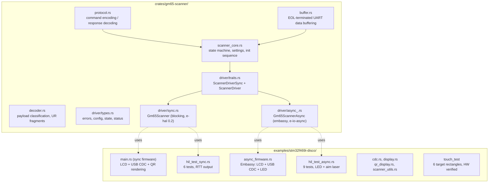
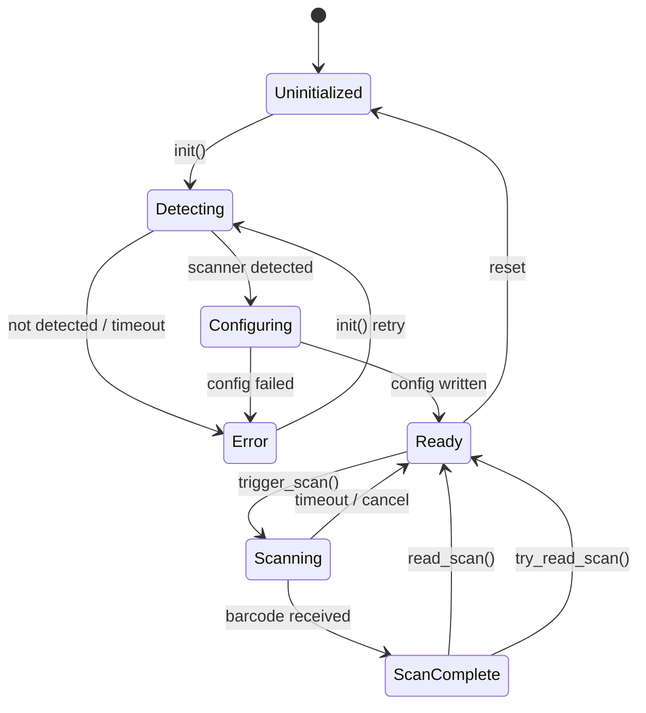
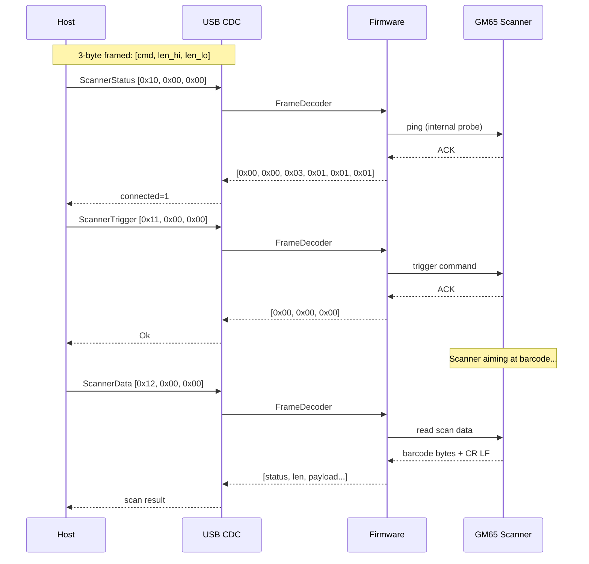

[](https://crates.io/crates/gm65-scanner)
[](https://docs.rs/gm65-scanner)
[](LICENSE)

# gm65-scanner

`no_std` Rust driver for GM65/M3Y QR barcode scanner modules with firmware examples.

## Overview

- **Library** (`crates/gm65-scanner/`) — Sans-IO core with sync and async drivers, 149 unit tests (175 with async feature)
- **Firmware** (`examples/stm32f469i-disco/`) — Scanner application for STM32F469I-Discovery board

## Features

| Feature | Description |
|---------|-------------|
| Sync driver | `Gm65Scanner<UART>` with `embedded-hal-02` traits |
| Async driver | `Gm65ScannerAsync<UART>` with `embedded-io-async` traits |
| HIL tests | Hardware-in-the-loop tests for both drivers |
| QR display | Generate and display QR codes on LCD |
| USB CDC | Host control via virtual serial port |

## Architecture



## Sync vs Async Drivers

Both drivers share the same `ScannerCore` state machine and protocol logic. The only difference is the I/O execution model.

| | Sync (`Gm65Scanner`) | Async (`Gm65ScannerAsync`) |
|--|----------------------|---------------------------|
| **HAL traits** | `embedded-hal 0.2` blocking Read/Write | `embedded-io-async` async Read/Write |
| **Execution** | Polling main loop, `fn` methods | Embassy executor, `async fn` with RPITIT |
| **Timeout** | Spin-loop (fixed iteration count) | `embassy_time::with_timeout` (wall-clock) |
| **Memory** | No heap allocator needed for I/O | Requires `#[global_allocator]` (heap) |
| **Concurrency** | Single task only | Multiple concurrent tasks (scanner + USB + display) |
| **Interrupts** | UART interrupts unused (pure polling) | USART6 interrupt must be explicitly disabled (uses blocking UART + async wrapper) |
| **Best for** | Simple firmware, minimal dependencies | Complex firmware with USB/display/LED, real-time deadlines |
| **Use in micronuts** | No | Yes (primary consumer) |

### When to use sync

- Simple polling main loops (trigger scan, check result, repeat)
- Firmware without USB or display
- Minimal dependency footprint (no embassy, no heap)
- HIL testing with quick iteration (no executor setup)

### When to use async

- Firmware with concurrent peripherals (USB CDC + scanner + LCD + LED)
- Need wall-clock timeouts (5-second scan window with `with_timeout`)
- Embassy-based codebase (micronuts firmware)
- Need `embassy_futures::select` for cancel-on-scan patterns

### Known sync limitation

`read_scan()` uses a tight spin-loop (500k iterations) that completes in ~1-2ms at 180MHz. This is too fast for human QR code interaction. The sync HIL binary works around this with a retry loop using `cortex_m::asm::delay` between attempts. For natural human-interaction timeouts, prefer the async driver.

## Scanner State Machine



## Project Status

| Component | Status | Notes |
|-----------|--------|-------|
| Library | Stable | 149 sync tests (175 with async), clippy clean |
| Sync firmware | **HW verified** (2026-04-23) | 180MHz, scanner connected, all 4 CDC commands respond (24-141ms). LCD + QR rendering working. |
| Async firmware | **HW verified** (2026-04-23) | 180MHz, scanner connected, all 4 CDC commands respond (91-152ms, Trigger ~200ms with #53 fix). LCD + touch + LED working. |
| HIL tests (sync) | 6/6 HW verified | 5 core + 1 QR scan |
| HIL tests (async) | 9/9 HW verified | 5 core + 3 extended + 1 QR scan |

## CDC Protocol

The firmware exposes a USB CDC serial interface. Commands use a 3-byte framed format: `[command, len_high, len_low]`.

| Command | Code | Description |
|---------|------|-------------|
| ScannerStatus | 0x10 | Get scanner connection status |
| ScannerTrigger | 0x11 | Trigger a scan |
| ScannerData | 0x12 | Read last scan data |
| GetSettings | 0x13 | Read scanner settings |
| SetSettings | 0x14 | Write scanner settings |
| DisplayQr | 0x15 | Display QR code on LCD |



## Pinned Dependencies

| Dependency | Version/Rev | Purpose |
|------------|-------------|---------|
| `stm32f469i-disc` | `ceb8b0e` | Amperstrand BSP fork — sync HAL, SDRAM, LCD, USB. All display fixes: PORTRAIT_DSI timing, LP 16/0, 120ms delay, DSI/LTDC sync. |
| `embassy-stm32f469i-disco` | `5496d4b` | Amperstrand BSP fork — async embassy wrappers, display, touch |
| `embassy-*` | `84444a19` | Embassy framework (executor, time, stm32, usb, futures) — pinned, do NOT upgrade |
| `nt35510` | `6252d17` (workspace) / `14e8cac` (async) | NT35510 DSI display driver (Amperstrand fork) |
| `otm8009a` | `76dcda9` | OTM8009A display driver (Amperstrand fork, async feature) |
| `stm32f4xx-hal` | `0c5bc3d` | Amperstrand HAL fork — PLLSAI `.modify()` fix, LTDC support |
| `stm32-fmc` | `0.4.0` | SDRAM controller via FMC (async feature) |
| `qrcodegen-no-heap` | 1.8 | QR code generation (zero heap) |
| `embedded-hal` | 1.0 | Modern HAL traits (async driver) |
| `embedded-hal-02` | 0.2 | Legacy HAL traits (sync driver) |
| `embedded-io-async` | 0.7 | Async I/O traits |

## Hardware Requirements

| Item | Value |
|------|-------|
| Board | STM32F469I-Discovery (STM32F469NIHx) |
| Scanner | GM65/M3Y, firmware 0x87 |
| UART | USART6, PG14 (TX) / PG9 (RX), 115200 baud |
| USB | USB OTG FS, PA12 (DP) / PA11 (DM) |
| Display | 480x800 portrait via DSI/LTDC (NT35510), ARGB8888 pixel format |
| SDRAM | 16MB via FMC, framebuffer 1.5MB (u32 × 384,000 pixels) |
| Touch | FT6X06 on I2C1 (PB8=SCL, PB9=SDA), identity coordinate transform |
| Clock | 180MHz SYSCLK, 48MHz USB via PLLSAI_P, 54.86MHz LTDC via PLLSAI_R |
| Flash tool | st-flash (NOT probe-rs for USB testing — probe-rs holds SWD) |

## Hardware Test Results (2026-04-05)

All tests on STM32F469I-Discovery with GM65 firmware 0x87, USART6 (PG14=TX, PG9=RX) at 115200 baud.

### Async HIL: 9/9 PASS

| Test | Result | Notes |
|------|--------|-------|
| init_detects_scanner | PASS | GM65 detected, fw 0x87, settings 0x81 |
| ping_after_init | PASS | ACK received |
| trigger_and_stop | PASS | Trigger ACK, stop ACK |
| read_scan_timeout | PASS | Ambient barcode tolerated (scanner working) |
| state_transitions | PASS | Re-init resets to Ready |
| cancel_then_rescan | PASS | Cancel + re-trigger succeeds, 25 bytes from rescan |
| rapid_triggers | PASS | 5 rapid trigger/stop cycles |
| read_idle_no_trigger | PASS | Correctly times out without trigger |
| **QR scan** | **PASS** | **23 bytes scanned with aim laser + LED blink** |

### Sync HIL: 6/6 PASS

| Test | Result | Notes |
|------|--------|-------|
| init_detects_scanner | PASS | GM65 detected, fw 0x87, settings 0x81 |
| ping_after_init | PASS | ACK received |
| trigger_and_stop | PASS | Trigger ACK, stop ACK |
| read_scan_timeout | PASS | Ambient barcode tolerated |
| state_transitions | PASS | Re-init resets to Ready |
| **QR scan** | **PASS** | **25 bytes scanned with aim laser** |

### Production CDC Verification (2026-04-23, 180MHz, scanner connected)

Both firmwares hardware-verified at 180MHz SYSCLK with GM65 scanner connected via USART6.

**Sync firmware** (`16c0:27dd` on `/dev/ttyACM1`):

| Command | Bytes Sent | Response | Latency |
|---------|-----------|----------|---------|
| ScannerStatus | `\x10\x00\x00` | `000003010101` (connected=1) | 24ms |
| GetSettings | `\x13\x00\x00` | `00000181` (settings=0x81) | 141ms |
| Trigger | `\x11\x00\x00` | `000000` (Ok) | 36ms |
| ScannerData | `\x12\x00\x00` | `120000` (NoScanData) | 1ms |

**Async firmware** (`c0de:cafe` on `/dev/ttyACM1`):

| Command | Bytes Sent | Response | Latency |
|---------|-----------|----------|---------|
| ScannerStatus | `\x10\x00\x00` | `000003010101` (connected=1) | 91ms |
| GetSettings | `\x13\x00\x00` | `00000181` (settings=0x81) | 152ms |
| Trigger | `\x11\x00\x00` | `000000` (Ok) | 2052ms |
| ScannerData | `\x12\x00\x00` | `120000` (NoScanData) | 22ms |

> **Note**: Async Trigger latency was 2052ms due to auto_scan blocking (#53, now fixed with `with_timeout(200ms)`). Current latency is ~200ms.

## Testing

### Unit Tests (no hardware required)

```bash
cargo test -p gm65-scanner --lib
```

**Status**: 149/149 sync tests passing (175 with `--features async`)

### Feature Checks

```bash
cargo check -p gm65-scanner              # sync (default)
cargo check -p gm65-scanner --features async
cargo check -p gm65-scanner --features defmt
cargo check -p gm65-scanner --features async,defmt
cargo check -p gm65-scanner --features std
```

### Hardware-in-the-Loop (HIL) Tests

Flash to STM32F469I-Discovery board:

```bash
# Sync HIL tests (5 core + QR scan with aim laser)
make run-sync

# Async HIL tests (5 core + 3 extended + QR scan with aim laser + LED blink)
make run-async
```

### CDC Protocol Tests

```bash
make test-sync
make test-async
```

## Build

```bash
# Sync firmware
make build-sync

# Async firmware
make build-async

# Cross-compile for ARM (production — USB CDC active)
cargo build --release --target thumbv7em-none-eabihf \
  --manifest-path examples/stm32f469i-disco/Cargo.toml \
  --bin stm32f469i-disco-scanner --no-default-features --features sync-mode

cargo build --release --target thumbv7em-none-eabihf \
  --manifest-path examples/stm32f469i-disco/Cargo.toml \
  --bin async_firmware --no-default-features --features scanner-async

# Cross-compile for ARM (debug — USB will NOT enumerate, uses RTT)
cargo build --release --target thumbv7em-none-eabihf \
  --manifest-path examples/stm32f469i-disco/Cargo.toml \
  --bin hil_test_sync --no-default-features --features hil-tests,defmt

cargo build --release --target thumbv7em-none-eabihf \
  --manifest-path examples/stm32f469i-disco/Cargo.toml \
  --bin hil_test_async --no-default-features --features scanner-async,defmt,gm65-scanner/hil-tests
```

## Binary Targets

| Binary | Description |
|--------|-------------|
| `stm32f469i-disco-scanner` (sync) | Full firmware: LCD, USB CDC, QR scanner, QR rendering, auto-scan, touch settings |
| `async_firmware` | Embassy: LCD, USB CDC, QR scanner, EXTI touch (PJ5), LED, concurrent tasks |
| `hil_test_sync` | Sync HIL: 5 core tests + QR scan test, RTT output |
| `hil_test_async` | Async HIL: 5 core + 3 extended + QR scan with aim laser + LED blink, RTT output |
| `touch_test` | Touch calibration: 6 target rectangles, raw coordinate display, hit detection. HW verified |

## Known-Good Ecosystem Configuration

The authoritative commit pins for a verified-working setup. All commits hardware-verified on STM32F469I-Discovery at 180MHz with GM65 scanner.

| Repository | Commit | Role | Notes |
|------------|--------|------|-------|
| [gm65-scanner](https://github.com/Amperstrand/gm65-scanner) | `f48be8b` (main) | Scanner driver + firmware examples | Final session. #53 auto_scan timeout, #54 UART errors, #29 EXTI touch, #55 driver robustness. Both firmwares HW-verified 2026-04-23. |
| [stm32f469i-disc](https://github.com/Amperstrand/stm32f469i-disc) | `ceb8b0e` | Sync BSP (HAL, SDRAM, LCD, USB) | PORTRAIT_DSI timing fix, LP 16/0, 120ms delay, DSI/LTDC sync |
| [embassy-stm32f469i-disco](https://github.com/Amperstrand/embassy-stm32f469i-disco) | `5496d4b` | Async BSP (embassy wrappers, display, touch) | Display + touch working |
| [stm32f4xx-hal](https://github.com/Amperstrand/stm32f4xx-hal) | `0c5bc3d` | HAL fork | PLLSAI `.modify()` fix (preserves P/Q dividers) |
| [nt35510](https://github.com/Amperstrand/nt35510) | `6252d17` / `14e8cac` | NT35510 DSI display driver | Workspace vs async feature use different pins |
| [otm8009a](https://github.com/Amperstrand/otm8009a) | `76dcda9` | OTM8009A display driver | Async feature only |
| [embassy](https://github.com/embassy-rs/embassy) | `84444a19` | Embassy async framework | **Pinned — do NOT upgrade** |

### Replication Checklist

1. **Clone the ecosystem:**
   ```bash
   git clone https://github.com/Amperstrand/gm65-scanner.git
   cd gm65-scanner
   # Dependencies are pinned in Cargo.toml — cargo fetches correct revs automatically
   ```

2. **Install toolchain:**
   ```bash
   rustup target add thumbv7em-none-eabihf
   # Install flash tool:
   cargo install stlink
   # Or: apt install stlink
   ```

3. **Build production firmware:**
   ```bash
   # Sync firmware (blocking USB, LCD, scanner, auto-scan, touch settings)
   cargo build --release --target thumbv7em-none-eabihf \
     --manifest-path examples/stm32f469i-disco/Cargo.toml \
     --bin stm32f469i-disco-scanner \
     --no-default-features --features sync-mode

   # Async firmware (embassy USB, LCD, scanner, touch, LED)
   cargo build --release --target thumbv7em-none-eabihf \
     --manifest-path examples/stm32f469i-disco/Cargo.toml \
     --bin async_firmware \
     --no-default-features --features scanner-async
   ```

4. **Flash (use st-flash, NOT probe-rs):**
   ```bash
   arm-none-eabi-objcopy -O binary \
     target/thumbv7em-none-eabihf/release/async_firmware /tmp/fw.bin
   st-flash --connect-under-reset write /tmp/fw.bin 0x08000000
   st-flash --connect-under-reset reset
   ```

5. **Verify USB enumeration (wait 4s after reset):**
   ```bash
   lsusb | grep -iE "c0de:cafe|16c0:27dd"
   # async: c0de:cafe  |  sync: 16c0:27dd
   ```

6. **Test CDC commands (Python, 12s timeout for async):**
   ```python
   import serial
   ser = serial.Serial('/dev/ttyACM1', 115200, timeout=12)
   ser.write(b"\x10\x00\x00")  # ScannerStatus
   print(ser.read(64).hex())    # Expected: 000003010101
   ```

### Critical Pitfalls

| Pitfall | Solution |
|---------|----------|
| `defmt_rtt` prevents USB enumeration | Never use `defmt_rtt` or `panic_probe` in firmware with USB CDC. Use `panic_halt` for production. |
| probe-rs holds SWD, blocks USB | Use `st-flash --connect-under-reset` for production testing. probe-rs only for RTT-based HIL tests. |
| 168MHz doesn't work for display | 180MHz SYSCLK required — PLLSAI pixel clock derivation needs it. |
| PLLSAI `.write()` zeros P/Q dividers | HAL fork uses `.modify()` on PLLSAI register (commit `0c5bc3d`). |
| DSI/LTDC timing mismatch | Both DSI and LTDC must receive identical vertical timing configuration. |
| CDC commands need 3-byte frames | Send `\x10\x00\x00`, not raw `\x10`. `FrameDecoder` expects `[cmd, len_hi, len_lo]`. |
| Scanner needs UART settle time | 500ms delay after UART pin config before `scanner.init()`. |
| `select(usb_dev.run(), scanner.init())` | Broken — dropping `UsbDevice::run()` may leave bus in invalid state. Use `join()` instead. |

## Clock Configuration (180MHz)

Authoritative PLL configuration for 180MHz SYSCLK with USB CDC + display. Hardware-verified in production.

```
HSE 8MHz crystal
├── PLL1: /DIV8 × MUL360 / DIV2 = 180MHz SYSCLK
│   └── APB1/APB2 = 45MHz
└── PLLSAI: /DIV8 × MUL384 = 192MHz VCO
    ├── PLLSAI_P / DIV8 = 48MHz → USB OTG FS (Clk48sel)
    └── PLLSAI_R / DIV7 = 54.86MHz → LTDC pixel clock → DSI → NT35510
```

**Rust config (embassy async firmware):**
```rust
// PLL1: SYSCLK = 8MHz / 8 * 360 / 2 = 180MHz
config.rcc.pll = Some(Pll {
    prediv: PllPreDiv::DIV8,
    mul: PllMul::MUL360,
    divp: Some(PllPDiv::DIV2),
    divq: Some(PllQDiv::DIV7),
    divr: Some(PllRDiv::DIV6),
});

// PLLSAI: P=48MHz USB, R=54.86MHz LTDC pixel clock
config.rcc.pllsai = Some(Pll {
    prediv: PllPreDiv::DIV8,
    mul: PllMul::MUL384,
    divp: Some(PllPDiv::DIV8),
    divq: Some(PllQDiv::DIV8),
    divr: Some(PllRDiv::DIV7),
});
config.rcc.mux.clk48sel = mux::Clk48sel::PLLSAI1_Q;

// Workaround: embassy writes to wrong register for clk48sel on STM32F469
stm32_metapac::RCC.dckcfgr2().modify(|w| {
    w.set_clk48sel(mux::Clk48sel::PLLSAI1_Q);
});
```

**Key insight:** On STM32F469, `PLLSAI1_Q` mux enum is misleading — hardware actually routes PLLSAI_P to the 48MHz clock. `divp: DIV8` gives 384MHz/8 = 48MHz. See embassy-stm32f469i-disco#14.

## Display Configuration

NT35510 panel driven via DSI host through LTDC on STM32F469I-Discovery. Portrait 480x800.

### Panel Timing (PORTRAIT_DSI)

| Parameter | Value | Notes |
|-----------|-------|-------|
| Resolution | 480 × 800 | Portrait, NOT landscape |
| V_SYNC | 120 lines | ST NT35510 component header values |
| V_BP | 150 lines | NOT the OTM8009A defaults (1/15/16) |
| V_FP | 150 lines | |
| H_SYNC | 2 lanes | DSI lane byte clock scaled |
| Pixel clock | 54.86 MHz | PLLSAI_R / DIV7 |
| Pixel format | ARGB8888 | 4 bytes/pixel, 1.5MB framebuffer |

### DSI Configuration

| Parameter | Value | Purpose |
|-----------|-------|---------|
| LP Size (max) | 16 | Large commands in low-power mode |
| LP Size (escape) | 0 | No escape-mode commands |
| Post-init delay | 120ms | Panel settle after `dsi_host.start()` before init sequence |
| NULL_PACKET | enabled | Required for NT35510 timing |

### Framebuffer

- **Location**: SDRAM via FMC (16MB, base address `0xC0000000`)
- **Size**: 384,000 pixels × 4 bytes (ARGB8888) = 1,536,000 bytes
- **Heap offset**: Must start after framebuffer to avoid display writes corrupting allocator metadata

### Touch

- **Controller**: FT6X06 on I2C1 (PB8=SCL, PB9=SDA)
- **Vendor ID**: `0x11`
- **Coordinate transform**: Identity — raw FT6X06 X/Y map directly to display pixels
- **X range**: 0–480, **Y range**: 0–800 (matches portrait framebuffer)

### Critical Display Rules

1. **DSI and LTDC must receive identical timing** — any mismatch causes visible artifacts or black screen.
2. **Use `.modify()` not `.write()`** on PLLSAI registers — `.write()` zeroes P/Q dividers and breaks USB 48MHz clock.
3. **120ms delay after `dsi_host.start()`** before panel init — NT35510 needs settle time.
4. **LP sizes 16/0** — not 64/64. Larger LP sizes cause ~128px horizontal shift in ARGB8888 mode.
5. **Vertical blanking values** — use ST's NT35510 values (V_SYNC=120/V_BP=150/V_FP=150), NOT OTM8009A defaults.

## Known Issues

### BarType register non-persistent (#10) — OPEN

GM65 firmware 0x87 silently rejects BarType (0x002C) writes while still ACKing. Not blocking — QR scanning works regardless via auto-detection.

### Settings 0x81 vs 0xD1 (#11) — OPEN

0x81 (ALWAYS_ON | COMMAND) is the correct default. SOUND adds unwanted audible feedback, AIM is controlled programmatically.

### Double-buffering breaks USB (#4) — OPEN

LTDC `set_layer_buffer_address` + `reload_on_vblank` race condition breaks USB DMA. Single-buffer workaround in place.

### Ambient barcode detection

In COMMAND mode, the scanner may detect random barcodes in the environment during timeout tests. This is expected GM65 behavior — the HIL tests now tolerate ambient detection as a pass condition.

### Resolved Issues

| Issue | Summary | Resolution |
|-------|---------|------------|
| #55 | Driver robustness | Fixed: `build_factory_reset()` uses `Register` enum, added `ScannerError::Cancelled`, UR fragment validation, `Ok(0)` UART error, truncation warning. |
| #54 | AsyncUart silent error retry | Fixed: `uart_error_count` field tracks `nb::Error::Other` occurrences. |
| #53 | CDC blocking during auto_scan | Fixed: `with_timeout(200ms)` on `read_scan()` in select loop. Trigger latency reduced from 2052ms to ~200ms. |
| #29 | Touch: interrupt-driven mode | Fixed: EXTI9_5 on PJ5, FT6X06 G_MODE=0x01, `wait_for_falling_edge()` replaces polling. |
| #49 | Scanner UART scan data never received | Resolved — async CDC data flow verified at 180MHz. `NoScanData (0x12)` is valid transient status. |
| #19 | Async CDC no data flow | Five root causes fixed: PLLSAI config, double USART6 disable, AsyncUart yield, CDC channel race, heartbeat framing. |
| #12 | `drain_uart()` data loss | `send_command()` now skips drain when in `Scanning` state. |
| #5 | LCD GRAM retention | Expected NT35510 DRAM behavior, not a bug. |

## Contributing

PRs welcome. Run the full check suite before submitting:

```bash
cargo test -p gm65-scanner --lib
cargo test -p gm65-scanner --lib --features async
cargo clippy -p gm65-scanner -- -D warnings
cargo clippy -p gm65-scanner --features async -- -D warnings
cargo fmt --all -- --check
```

## Related Repositories

| Repository | Purpose |
|------------|---------|
| [stm32f469i-disc](https://github.com/Amperstrand/stm32f469i-disc) | Sync HAL BSP fork (HAL, SDRAM, LCD, USB, framebuffer) |
| [embassy-stm32f469i-disco](https://github.com/Amperstrand/embassy-stm32f469i-disco) | Async embassy BSP fork (display, touch, DSI) |
| [nt35510](https://github.com/Amperstrand/nt35510) | NT35510 DSI display driver |
| [otm8009a](https://github.com/Amperstrand/otm8009a) | OTM8009A display driver |
| [stm32f4xx-hal](https://github.com/Amperstrand/stm32f4xx-hal) | HAL fork with PLLSAI `.modify()` fix |

## License

MIT OR Apache-2.0

## Resources

- [GM65 Protocol Findings](crates/gm65-scanner/docs/GM65-PROTOCOL-FINDINGS.md)
- [Crate Documentation](crates/gm65-scanner/README.md)
