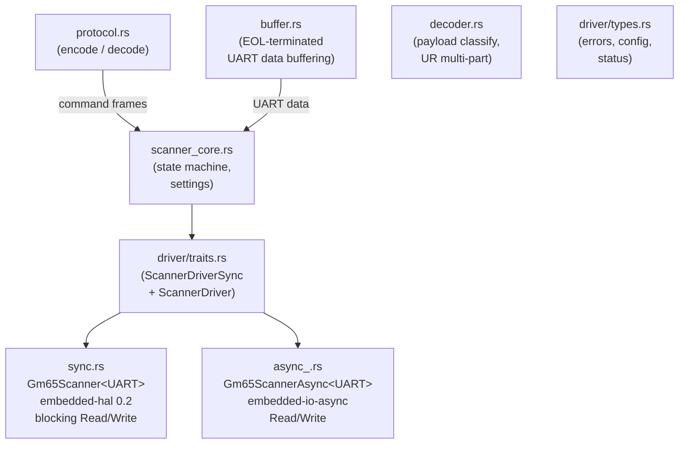
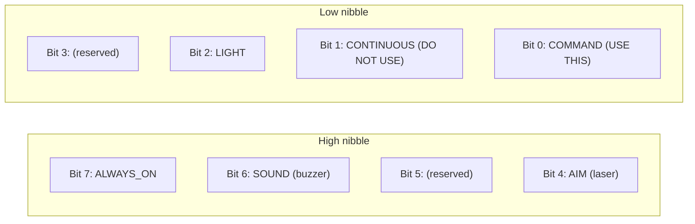
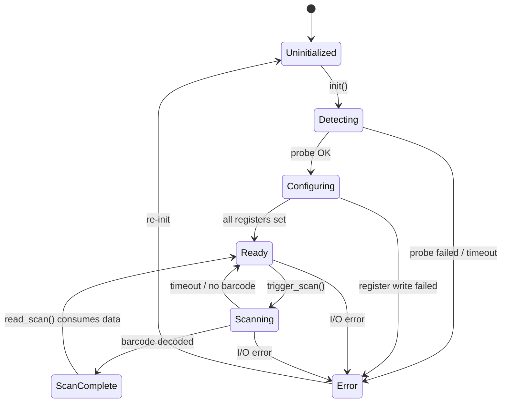
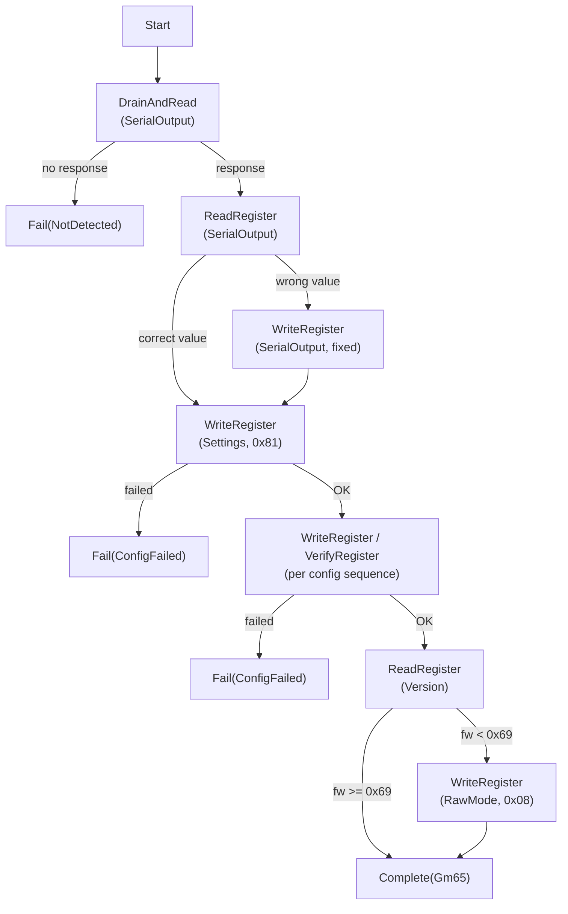
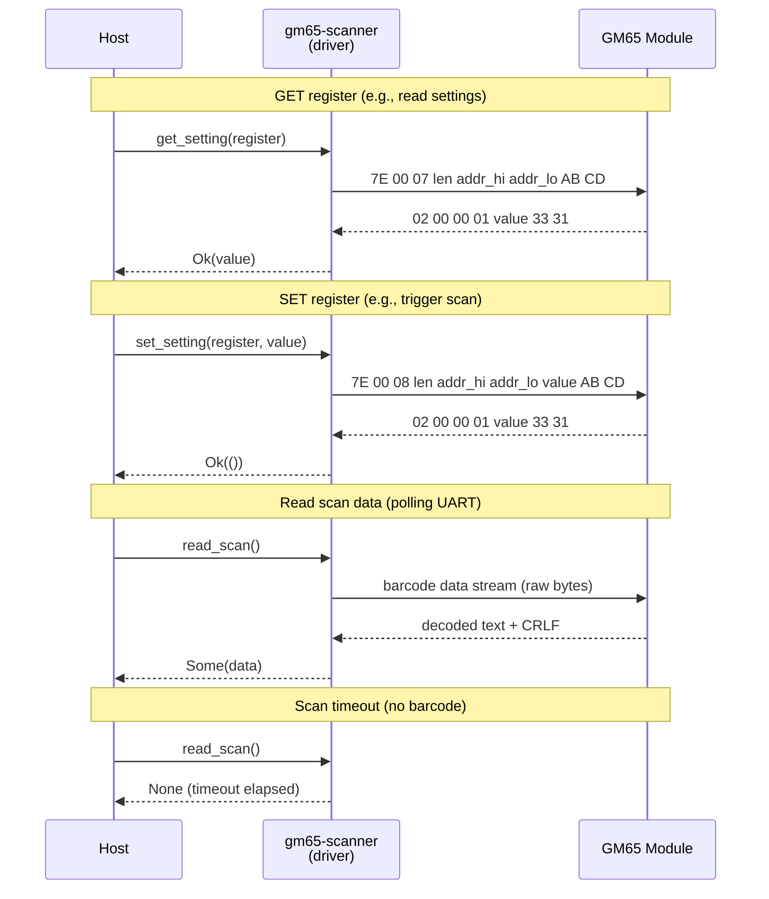

# gm65-scanner

`no_std` UART driver for GM65/M3Y QR barcode scanner modules.

These scanners communicate via UART and handle QR decoding internally — the host only needs to read the decoded data.

## Protocol

This driver uses the real GM65 protocol as reverse-engineered from the [specter-diy](https://github.com/cryptoadvance/specter-diy) project, NOT the protocol described in the GM65 datasheet (which is incorrect). See `docs/GM65-PROTOCOL-FINDINGS.md` for details.

## Features

| Feature | Default | Description |
|---------|---------|-------------|
| `sync` | Yes | `Gm65Scanner<UART>` with blocking `embedded-hal-02` traits |
| `async` | No | `Gm65ScannerAsync<UART>` with `embedded-io-async` traits |
| `defmt` | No | `defmt::Format` derives on all public types |
| `hil-tests` | No | Hardware-in-the-loop tests (requires `defmt`) |

## Sync vs Async

Both drivers share `ScannerCore` — the same state machine, protocol logic, and buffer handling. The I/O layer is the only difference.

### `Gm65Scanner<UART>` (sync)

- Uses `embedded-hal 0.2` blocking `Read`/`Write` traits
- All methods are plain `fn` — no executor needed
- `read_scan()` uses a tight spin-loop that completes in ~1-2ms at 180MHz
- Best for simple polling firmware or HIL test binaries

### `Gm65ScannerAsync<UART>` (async)

- Uses `embedded-io-async` async `Read`/`Write` traits
- Methods are `async fn` with RPITIT — requires an executor (embassy)
- Timeouts via `embassy_time::with_timeout` (real wall-clock deadlines)
- Best for firmware with concurrent tasks (USB + display + scanner)

**Recommendation**: Use async if your firmware already uses embassy. The wall-clock timeouts make human-interaction scanning natural (e.g., 5-second QR scan window). The sync driver's spin-loop timeout is too fast for human interaction without a retry loop.

## Architecture



### Design Patterns

**Sans-IO Core**: `scanner_core.rs` contains all state machine logic, settings management, and buffer handling with zero I/O dependencies. Both sync and async drivers share this core.

**Dual Driver Traits**: Two traits define the driver contract:
- `ScannerDriverSync` — blocking methods (`fn init(&mut self) -> Result<...>`)
- `ScannerDriver` — async methods with RPITIT (`fn init(&mut self) -> impl Future<...>`)

Both traits expose identical semantics — only the execution model differs.

**Settings Register 0x0000 Bit Layout**:


Common values: `0x81` = ALWAYS_ON | COMMAND (this driver's default), `0xD1` = ALWAYS_ON | SOUND | AIM | COMMAND (specter-diy default)

## Scanner State Machine

Both sync and async drivers use the same `ScannerState` enum internally. The state machine governs all operations from initialization through scanning.



### Init Sequence

The `init()` method drives a multi-step `InitAction` state machine inside `ScannerCore`. Each step returns an action for the driver to execute, then the result is fed back to advance to the next step.



## UART Protocol

The GM65 protocol uses a simple request/response format over UART. Commands have a header and sentinel suffix; responses use a different fixed format.



## Usage

```toml
[dependencies]
gm65-scanner = "0.2"
```

### Sync (blocking)

```rust,ignore
use gm65_scanner::{Gm65Scanner, ScannerDriverSync};

let mut scanner = Gm65Scanner::with_default_config(uart);
scanner.init()?;
scanner.trigger_scan()?;

if let Some(data) = scanner.read_scan() { /* ... */ }
if let Some(data) = scanner.try_read_scan() { /* ... */ }
```

### Async (embassy)

```toml
[dependencies]
gm65-scanner = { version = "0.2", features = ["async", "defmt"] }
```

```rust,ignore
use gm65_scanner::{Gm65ScannerAsync, ScannerDriver};

let mut scanner = Gm65ScannerAsync::with_default_config(uart);
scanner.init().await?;
scanner.trigger_scan().await?;
if let Some(data) = scanner.read_scan().await { /* ... */ }
```

## Testing

```bash
cargo test -p gm65-scanner           # sync tests
cargo test -p gm65-scanner --features async  # sync + async tests
cargo clippy -p gm65-scanner -- -D warnings
cargo fmt --all -- --check
```

### Test Coverage

| Module | What's Covered |
|--------|----------------|
| `protocol.rs` | Command frames match specter-diy bytes, response parsing, register addresses |
| `scanner_core.rs` | State machine, init sequence (all InitAction paths), settings, serial output fix |
| `buffer.rs` | Push, clear, EOL detection (`\r\n`, `\r`, `\n`), data stripping, overflow |
| `decoder.rs` | Payload classification, UR fragment parsing, multi-part reassembly, edge cases |
| `driver/types.rs` | Display formatting, config defaults, status fields |
| `driver/sync.rs` | Mock UART tests: init, ping, get/set setting, trigger/stop, state transitions |
| `driver/async_.rs` | Mock UART tests: init, ping, get/set setting, trigger/stop, cancel, state transitions |

## HIL Tests

The `hil-tests` feature provides on-device tests that verify real hardware behavior.

### Sync: 6/6 PASS on hardware

| Test | Description |
|------|-------------|
| `test_init_detects_scanner` | Scanner initializes, model detected |
| `test_ping_after_init` | Ping returns true after init |
| `test_trigger_and_stop` | Trigger ACK, stop ACK, state transitions |
| `test_read_scan_timeout` | read_scan times out (ambient barcode tolerated) |
| `test_state_transitions` | Re-init resets to Ready state |
| `run_hil_test_with_qr` | Trigger + read real QR code (5s retry loop, aim laser) |

### Async: 9/9 PASS on hardware

| Test | Description |
|------|-------------|
| `test_init_detects_scanner` | Scanner initializes, model detected |
| `test_ping_after_init` | Ping returns true after init |
| `test_trigger_and_stop` | Trigger ACK, stop ACK, state transitions |
| `test_read_scan_timeout` | read_scan times out (ambient barcode tolerated) |
| `test_state_transitions` | Re-init resets to Ready state |
| `test_cancel_then_rescan` | Cancel scan, re-trigger succeeds |
| `test_rapid_triggers` | 5 rapid trigger/stop cycles |
| `test_read_idle_no_trigger` | read_scan without trigger times out |
| `run_hil_test_with_qr` | Trigger + read QR code (5s timeout, aim laser + LED blink) |

### drain_uart Protection

Both drivers skip UART draining when in `Scanning` state, preventing in-flight scan data loss.

## Example Firmware

See the `examples/stm32f469i-disco/` workspace member for firmware targeting the STM32F469I-Discovery board.

### Sync (`sync-mode` feature)

Scanner + USB CDC + LCD display + QR rendering. Polling main loop.

### Async (`scanner-async` feature)

Scanner + USB CDC + LED + LCD display + QR rendering. Embassy executor with concurrent tasks.

### Hardware

| Item | Value |
|------|-------|
| Board | STM32F469I-Discovery (STM32F469NIHx) |
| Scanner | GM65/M3Y, firmware v0x87 |
| UART | USART6, PG14 (TX) / PG9 (RX), 115200 baud |
| USB | USB OTG FS, PA12 (DP) / PA11 (DM) |

## Known Limitations

- **BarType register (0x002C)**: Write is ACKed but not persisted on GM65 firmware 0.87. Not blocking — QR scanning works regardless.
- **embassy-stm32 USART6 interrupt**: Must be explicitly disabled when using blocking UART with async wrapper. See `hil_test_async.rs` for the pattern.
- **Ambient barcode detection**: In COMMAND mode, the scanner may detect random barcodes in the environment. HIL timeout tests tolerate this as a pass condition.
- **Sync read_scan timeout**: The spin-loop completes in ~1-2ms, too fast for human QR scanning. Use a retry loop with `cortex_m::asm::delay` in test code, or prefer the async driver.

## License

MIT OR Apache-2.0
